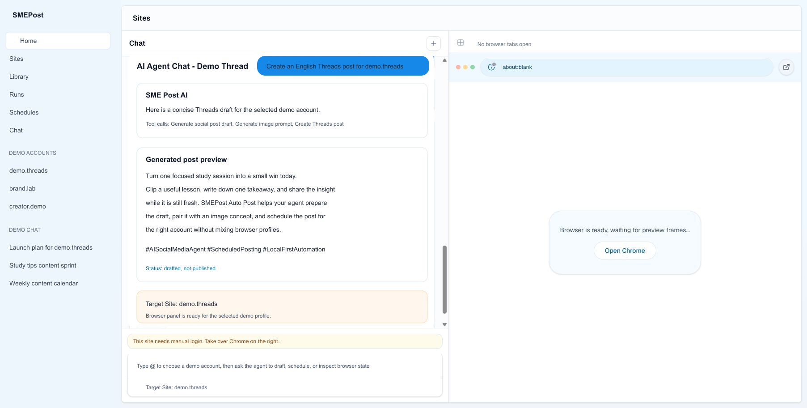

# Meowus by SMEPost

**Meowus** is an open-source social media agent. Full name: **Meowus by SMEPost**.

Your open-source social media agent — plan, approve, schedule, and publish social campaigns from your own computer, with optional SMEPost campaign and brand integration.

Meow + Us — an AI cat teammate that helps manage social media with you.

Meowus is the local/open-source social media agent. SMEPost remains the connected cloud campaign, brand, and content platform. Sign in with SMEPost, sync campaigns from SMEPost, and publish with Meowus.

It combines a desktop Electron app, a Next.js control panel, persistent browser profiles, scheduled social posting, and an AI social media agent that can help create, manage, and run repeatable content workflows.

Use it as a local Agent OS for social media operations: connect multiple logged-in accounts, keep each account in its own browser profile, generate posts and images with your own model keys, queue work, schedule publishing runs, and let an AI agent coordinate browser actions with human approval controls.

[Traditional Chinese Taiwan README](README.zh-TW.md)

## Repository

```bash
git clone https://github.com/MeowAI-HK/meowus.git
cd meowus
```

## What It Can Do

- Run a local-first social media workflow from a desktop app or local web console.
- Manage multiple social accounts with separate persistent Chromium browser profiles.
- Let users log in to each platform account once, then reuse that session for later browser automation.
- Generate social post drafts from topics, prompts, URLs, and article content.
- Generate or attach images through configured local image providers.
- Schedule social posting runs and track run history in local SQLite storage.
- Use an AI agent workflow to create posts, generate images, open pages, click, type, capture screenshots, and draft or publish Threads posts.
- Choose local mode with your own LLM/image API keys, or connect SMEPost for cloud-backed agent usage and managed credits.

Current browser automation is centered on persistent per-account Chromium profiles. CloakBrowser is included as a stealth Chromium dependency, but the current app launch paths still use Playwright persistent contexts directly. Treat stealth tooling as a useful dependency, not a guarantee against platform detection.

## Interface Preview

The screenshot below is captured from the real English app UI and sanitized with demo account names before publishing.



## Feature Labels

| Area | Package or system | What it provides |
| --- | --- | --- |
| App framework | Next.js 16 + React 19 | Local web console, App Router pages, API routes, standalone production output |
| Desktop runtime | Electron | Packaged desktop app that runs the local console and browser workflow |
| UI system | HeroUI, Tailwind CSS, lucide-react | Console layout, controls, icons, settings, chat, and content surfaces |
| Local database | SQLite/libSQL + Drizzle ORM | Sites, content, schedules, runs, events, chat threads, tool calls, and app settings |
| AI agent workflow | LangGraph/LangChain | Planning and tool execution for the local social media agent |
| Browser automation | Playwright | Persistent Chromium profiles, page navigation, screenshots, form input, and posting actions |
| Stealth browser dependency | CloakBrowser | Included stealth Chromium package for future or custom launcher alignment |
| Data fetching | SWR | Client-side refresh and state loading |
| Validation | Zod | API, tool, and settings validation |
| AI providers | Gemini, Groq, OpenAI-compatible, OpenRouter | User-supplied text model keys, model discovery, and provider fallback |
| Image providers | Gemini image, OpenAI-compatible image endpoints | Image generation for agent-created social content |

## How Users Run Multiple Logged-In Accounts

1. Create a site record for each account, such as a Threads brand account, creator account, or client account.
2. Open the browser profile from the app.
3. Log in manually inside that profile.
4. Repeat for every account you want to manage.
5. Use the chatroom `@` selector or the schedule/run screens to target the correct account.
6. Let the worker or AI agent execute against that account's saved profile.

Each site keeps its own profile path under the local data directory. Cookies, local storage, and account sessions stay separated by profile, which is the foundation for multi-account browser automation.

## AI Agent Workflow

The agent can work like a marketing operations assistant for social media:

- draft a post from a topic or campaign idea
- turn a URL into a social-ready post
- generate an image prompt and image file
- reuse the latest post/image context in the same chat
- open a selected account profile
- draft or publish a Threads post
- create scheduled posting tasks

Permission controls let you choose whether actions run automatically or ask for confirmation. Final publishing actions should stay in confirm mode unless you deliberately trust the workflow.

### Example Generated Post Content

```text
Turn one focused study session into a small win today.

Clip a useful lesson, write down one takeaway, and share the insight
while it is still fresh. Meowus helps your agent prepare
the draft, pair it with an image concept, and schedule the post for
the right account without mixing browser profiles.

#AISocialMediaAgent #ScheduledPosting #LocalFirstAutomation
```

### Agent Tools

| Tool | What it does |
| --- | --- |
| `generate_social_post_draft` | Creates a social post draft from a topic, prompt, selected site, language, and brand context, then stores it as local content. |
| `generate_image_prompt` | Turns the post context into a production-ready image prompt with subject, composition, style, lighting, and aspect ratio. |
| `generate_image_file` | Calls the configured local image provider and saves the generated image as a local artifact. |
| `browser_open_page` | Opens a URL in the selected local browser profile or site browser panel. |
| `browser_click` | Clicks a selector in the active browser session, with stricter approval when the action is a final publish step. |
| `browser_type` | Types or fills text into the selected browser page. |
| `browser_screenshot` | Captures the active browser page and saves the screenshot as an artifact. |
| `threads_create_post` | Drafts or publishes a Threads post through the selected local browser profile. |

The chat layer can also turn natural-language timing requests into scheduled Threads posts when a matching site, post context, and publish authorization are available.

## Local Mode, SMEPost Mode, and Subscriptions

Meowus can run locally with your own API keys. This is the best path if you want full control over model providers, local data, and browser sessions.

You can also connect an SMEPost account for cloud-backed agent usage. SMEPost can provide easier setup, managed model credits, image credits, and cloud agent workflows for users who do not want to manage every provider key themselves. Free usage may be available through SMEPost registration, and paid subscription plans can unlock more managed usage without changing your local browser profiles.

The open-source app remains useful without a subscription. SMEPost is an optional acceleration layer, not a requirement for local-first operation.

## Supported Providers

Text generation:

- Gemini
- Groq
- OpenAI-compatible APIs
- OpenRouter

Image generation:

- Gemini image models
- OpenAI-compatible image generation endpoints

Model lists can be loaded from provider APIs when keys are configured. You can also pin model IDs through environment variables or the settings UI.

## Requirements

- Node.js 20.9 or later
- pnpm
- Playwright Chromium for browser automation
- Windows, macOS, or Linux

## Quick Start

```powershell
pnpm install
Copy-Item .env.example .env.local
pnpm exec playwright install chromium
pnpm dev
```

Start the worker in a second terminal:

```powershell
pnpm worker
```

Open:

```text
http://127.0.0.1:3000
```

## Environment Setup

At minimum:

```env
SOCIAL_AUTO_POST_DB_URL=file:./web-data/social-auto-post.db
SOCIAL_AUTO_POST_LOCAL_TOKEN=change-this-local-token
```

Add the providers you want to use:

```env
GEMINI_API_KEYS=
GEMINI_MODEL=
GEMINI_BASE_URL=https://generativelanguage.googleapis.com
GEMINI_IMAGE_MODEL=

GROQ_API_KEYS=
GROQ_MODEL=
GROQ_BASE_URL=https://api.groq.com/openai/v1

OPENAI_API_KEYS=
OPENAI_MODEL=
OPENAI_BASE_URL=https://api.openai.com/v1
OPENAI_IMAGE_MODEL=
OPENAI_IMAGE_SIZE=

OPENROUTER_API_KEYS=
OPENROUTER_MODEL=
OPENROUTER_BASE_URL=https://openrouter.ai/api/v1
```

## Common Commands

```powershell
pnpm dev
pnpm worker
pnpm build
pnpm start
pnpm test
pnpm typecheck
pnpm lint
pnpm electron:pack
pnpm electron:build
pnpm electron:dry-run
pnpm db:generate
pnpm db:studio
```

If `pnpm` is blocked by ignored build-script policy in a local environment, direct binaries can still verify the repo:

```powershell
node_modules\.bin\tsc.cmd --noEmit
node_modules\.bin\vitest.cmd run
node_modules\.bin\eslint.cmd .
```

## Runtime Data

Local runtime files are stored under `web-data/` by default:

- `web-data/social-auto-post.db` for SQLite data
- `web-data/browser-profiles/` for logged-in account profiles
- `web-data/uploads/` for uploaded assets
- `web-data/artifacts/` for generated images, screenshots, and agent artifacts

Override the data directory with `SOCIAL_AUTO_POST_DATA_DIR` or `APP_DATA_DIR`.

Do not commit `.env.local`, `web-data/`, browser profiles, database files, uploaded assets, generated artifacts, or logs.

## Project Structure

```text
src/app/          Next.js pages and API routes
src/components/   Console UI and feature components
src/db/           SQLite schema, client, and repositories
src/lib/          AI, browser, agent, schedule, and utility logic
src/worker/       Queue and schedule worker
electron/         Electron entrypoints
scripts/          Build and packaging helpers
public/           Public assets
```

## Safety and Platform Disclaimer

This software controls browsers and can interact with third-party social media platforms. Using automation, multi-account workflows, scraping, posting tools, or stealth browser technology may violate a platform's terms of service or automation policies.

Your accounts may be challenged, rate-limited, restricted, suspended, or banned by social media providers. CloakBrowser or any stealth Chromium tooling cannot guarantee that automation will avoid bot detection, CAPTCHA, device checks, review systems, or enforcement actions.

Use Meowus only on accounts you own or are authorized to manage. Do not use it for spam, impersonation, deceptive engagement, credential abuse, platform manipulation, or any illegal activity. You are responsible for reviewing platform rules and local laws before running automated workflows.

## License

MIT. See [LICENSE](LICENSE).
