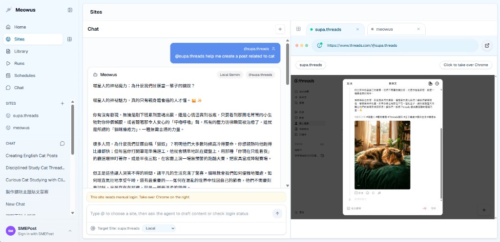

# Meowus by SMEPost

**Meowus** 是一個開源 AI 社群媒體代理。完整名稱：**Meowus by SMEPost**。

你的開源社群媒體代理 — 在自己的電腦上規劃、核准、排程與發布社群活動，並可選擇串接 SMEPost 的活動與品牌整合。

Meow + Us — 一隻陪你一起管理社群媒體的 AI 貓咪隊友。

Meowus 是本機／開源的社群媒體代理；SMEPost 仍是雲端活動、品牌與內容平台。請使用 SMEPost 登入、從 SMEPost 同步活動，並以 Meowus 發布。

它整合 Electron 桌面 app、Next.js 控制台、持久化瀏覽器 profile、排程發文，以及可以協助建立與執行社群任務的 AI social media agent。

你可以把它當成行銷工作用的本機 Agent OS：連接多個已登入帳號、讓每個帳號使用獨立瀏覽器 profile、用自己的模型 API key 生成貼文與圖片、建立 queue、安排 scheduled social posting，並讓 AI agent 在人工核准機制下協調瀏覽器操作。

[English README](README.md)

## 下載及執行 Meowus

請從 [GitHub Releases](https://github.com/MeowAI-HK/meowus/releases) 下載最新版本。正式發佈使用版本標籤，例如 `v0.1.0`。

### Windows

- **安裝程式（`Meowus Setup <版本>.exe`）**：下載並執行安裝程式，然後從開始功能表開啟 Meowus。
- **可攜式 ZIP（`Meowus-Windows-x64.zip`）**：將整個 ZIP 解壓縮到固定資料夾，再開啟 `win-unpacked` 內的 `Meowus.exe`。請勿單獨移動該 EXE，因為它需要旁邊的 `resources` 檔案。
- GitHub Windows 下載檔是刻意維持**未簽署**。Microsoft SmartScreen 可能顯示警告；只有在確認檔案來自此 repository 的官方 GitHub Release 時，才選擇「更多資訊」→「仍要執行」。

### macOS

1. 下載適合你 Mac 的 `.dmg`。
2. 開啟 DMG，將 **Meowus** 拖到 **Applications**。
3. 從 Applications 開啟 Meowus。

正式 macOS 發佈會以 Apple Developer ID 簽署並完成 Apple 公證。更新 app 不會刪除保留在你電腦上的本機資料庫、瀏覽器 profile、上傳檔案或生成的 artifacts。

## 原始碼倉庫

```bash
git clone https://github.com/MeowAI-HK/meowus.git
cd meowus
```

## 這套軟體可以做什麼

- 在桌面 app 或本機網頁控制台中執行 local-first social media workflow。
- 管理多個社群帳號，並為每個帳號保存獨立的持久化 Chromium browser profile。
- 讓使用者先手動登入各平台帳號，之後重複使用同一個 session 進行瀏覽器自動化。
- 從主題、prompt、URL 或文章內容生成社群貼文草稿。
- 透過設定的圖片 provider 生成或附加圖片。
- 建立 scheduled social posting runs，並在本機 SQLite 中追蹤執行紀錄。
- 使用 AI agent workflow 建立貼文、生成圖片、開啟頁面、點擊、輸入、截圖，以及在 Threads 草擬或發布貼文。
- 使用自己的 LLM/image API key 執行 local mode，或連接 SMEPost 使用雲端 agent 與 managed credits。

目前瀏覽器自動化的核心是每個帳號各自獨立的持久化 Chromium profile。專案包含 CloakBrowser 作為 stealth Chromium dependency，但目前 app 的啟動路徑仍直接使用 Playwright persistent contexts。請把 stealth tooling 視為有用的依賴，而不是能保證避開平台偵測的承諾。

## 介面預覽

下方截圖來自真實 Meowus app UI，發布前已替換成 demo 帳號名稱，避免顯示真實站點資料。



## 套件與功能標籤

| 範圍 | 套件或系統 | 提供能力 |
| --- | --- | --- |
| App framework | Next.js 16 + React 19 | 本機控制台、App Router 頁面、API routes、standalone production output |
| Desktop runtime | Electron | 封裝桌面 app，執行本機控制台與瀏覽器 workflow |
| UI system | HeroUI, Tailwind CSS, lucide-react | Console layout、控制項、icon、設定、chat、內容頁面 |
| Local database | SQLite/libSQL + Drizzle ORM | 站點、內容、排程、runs、events、chat threads、tool calls、app settings |
| AI agent workflow | LangGraph/LangChain | 本機社群媒體 agent 的規劃與工具執行 |
| Browser automation | Playwright | 持久化 Chromium profiles、頁面導覽、截圖、表單輸入、發文動作 |
| Stealth browser dependency | CloakBrowser | 已納入的 stealth Chromium 套件，可供未來或客製 launcher alignment 使用 |
| Data fetching | SWR | Client-side refresh 與狀態載入 |
| Validation | Zod | API、tool、settings validation |
| AI providers | Gemini, Groq, OpenAI-compatible, OpenRouter | 使用者自備文字模型 key、model discovery、provider fallback |
| Image providers | Gemini image, OpenAI-compatible image endpoints | 為 AI agent 社群內容生成圖片 |

## 如何使用多個已登入帳號

1. 為每個帳號建立一個 site record，例如品牌 Threads 帳號、創作者帳號或客戶帳號。
2. 從 app 開啟該帳號的 browser profile。
3. 在該 profile 中手動登入平台。
4. 對每個要管理的帳號重複以上流程。
5. 在 chatroom 使用 `@` selector，或在 schedule/run 頁面選擇正確帳號。
6. 讓 worker 或 AI agent 對該帳號保存的 profile 執行任務。

每個 site 都會在本機資料目錄下保存自己的 profile path。Cookies、local storage 與帳號 session 會依 profile 分開，這是 multi-account browser automation 的基礎。

## AI Agent Workflow

Agent 可以像社群行銷營運助理一樣工作：

- 依主題或 campaign idea 草擬貼文
- 將 URL 轉成社群貼文
- 生成 image prompt 與圖片檔
- 在同一個 chat 中沿用最新貼文與圖片 context
- 開啟指定帳號 profile
- 草擬或發布 Threads 貼文
- 建立排程發文任務

Permission controls 可讓你選擇動作自動執行，或先要求人工確認。除非你非常信任 workflow，最終發布動作建議維持 confirm mode。

### 生成貼文範例

```text
Turn one focused study session into a small win today.

Clip a useful lesson, write down one takeaway, and share the insight
while it is still fresh. Meowus helps your agent prepare
the draft, pair it with an image concept, and schedule the post for
the right account without mixing browser profiles.

#AISocialMediaAgent #ScheduledPosting #LocalFirstAutomation
```

### Agent Tools

| Tool | 功能 |
| --- | --- |
| `generate_social_post_draft` | 依主題、prompt、選定站點、語言與品牌 context 生成社群貼文草稿，並存成本機內容。 |
| `generate_image_prompt` | 將貼文 context 轉成可用於圖片生成的 prompt，包含主體、構圖、風格、光線與比例。 |
| `generate_image_file` | 呼叫設定好的本機圖片 provider，並將生成圖片存成本機 artifact。 |
| `browser_open_page` | 在選定的本機 browser profile 或 site browser panel 中開啟 URL。 |
| `browser_click` | 在目前 browser session 中點擊 selector；若是最終發布動作，會套用更嚴格的 approval。 |
| `browser_type` | 在選定的 browser page 中輸入或填入文字。 |
| `browser_screenshot` | 擷取目前 browser page，並將截圖存成 artifact。 |
| `threads_create_post` | 透過選定的本機 browser profile 草擬或發布 Threads 貼文。 |

Chat layer 也能在已有站點、貼文 context 與發布授權時，將自然語言時間要求轉成 scheduled Threads post。

## Local Mode、SMEPost Mode 與訂閱

Meowus 可以使用你自己的 API keys 在本機執行。若你重視模型 provider、本機資料、瀏覽器 session 的控制權，這是最直接的使用方式。

你也可以連接 SMEPost 帳號使用雲端 agent。SMEPost 可提供更簡單的設定流程、managed model credits、image credits，以及不想自行維護所有 provider key 的 cloud agent workflows。使用者可透過 SMEPost 註冊取得免費使用額度；付費訂閱則可解鎖更多 managed usage，而且不會改變你的本機瀏覽器 profiles。

這個開源 app 不需要訂閱也能使用。SMEPost 是可選的加速層，不是 local-first operation 的必要條件。

## 支援的 Providers

文字生成：

- Gemini
- Groq
- OpenAI-compatible APIs
- OpenRouter

圖片生成：

- Gemini image models
- OpenAI-compatible image generation endpoints

設定 key 後，app 可從 provider API 載入 model list。你也可以透過環境變數或 settings UI 指定 model ID。

## 系統需求

- Node.js 20.9 或更新版本
- pnpm
- Playwright Chromium，用於 browser automation
- Windows、macOS 或 Linux

## 快速開始

```powershell
pnpm install
Copy-Item .env.example .env.local
pnpm exec playwright install chromium
pnpm dev
```

在第二個 terminal 啟動 worker：

```powershell
pnpm worker
```

開啟：

```text
http://127.0.0.1:3000
```

## 環境設定

最低設定：

```env
SOCIAL_AUTO_POST_DB_URL=file:./web-data/social-auto-post.db
SOCIAL_AUTO_POST_LOCAL_TOKEN=change-this-local-token
```

再加入你想使用的 provider：

```env
GEMINI_API_KEYS=
GEMINI_MODEL=
GEMINI_BASE_URL=https://generativelanguage.googleapis.com
GEMINI_IMAGE_MODEL=

GROQ_API_KEYS=
GROQ_MODEL=
GROQ_BASE_URL=https://api.groq.com/openai/v1

OPENAI_API_KEYS=
OPENAI_MODEL=
OPENAI_BASE_URL=https://api.openai.com/v1
OPENAI_IMAGE_MODEL=
OPENAI_IMAGE_SIZE=

OPENROUTER_API_KEYS=
OPENROUTER_MODEL=
OPENROUTER_BASE_URL=https://openrouter.ai/api/v1
```

## 常用指令

```powershell
pnpm dev
pnpm worker
pnpm build
pnpm start
pnpm test
pnpm typecheck
pnpm lint
pnpm electron:pack
pnpm electron:build
pnpm electron:dry-run
pnpm db:generate
pnpm db:studio
```

如果本機環境因 ignored build-script policy 導致 `pnpm` 被阻擋，可用 direct binaries 驗證：

```powershell
node_modules\.bin\tsc.cmd --noEmit
node_modules\.bin\vitest.cmd run
node_modules\.bin\eslint.cmd .
```

## Runtime Data

本機 runtime 檔案預設存放在 `web-data/`：

- `web-data/social-auto-post.db`：SQLite data
- `web-data/browser-profiles/`：已登入帳號 profiles
- `web-data/uploads/`：上傳素材
- `web-data/artifacts/`：生成圖片、截圖、agent artifacts

可透過 `SOCIAL_AUTO_POST_DATA_DIR` 或 `APP_DATA_DIR` 覆寫資料目錄。

請不要 commit `.env.local`、`web-data/`、browser profiles、database files、uploaded assets、generated artifacts 或 logs。

## Project Structure

```text
src/app/          Next.js pages and API routes
src/components/   Console UI and feature components
src/db/           SQLite schema, client, and repositories
src/lib/          AI, browser, agent, schedule, and utility logic
src/worker/       Queue and schedule worker
electron/         Electron entrypoints
scripts/          Build and packaging helpers
public/           Public assets
```

## 安全與平台風險聲明

這套軟體會控制瀏覽器，並可能與第三方社群平台互動。使用自動化、多帳號 workflows、scraping、posting tools 或 stealth browser technology，可能違反平台服務條款或自動化政策。

你的帳號可能被要求驗證、被 rate-limit、限制功能、停權或封鎖。CloakBrowser 或任何 stealth Chromium tooling 都不能保證自動化能避開 bot detection、CAPTCHA、device checks、人工審查或平台執法。

請只在你擁有或被授權管理的帳號上使用 Meowus。不要將它用於 spam、冒充、欺騙性互動、憑證濫用、平台操縱或任何非法行為。你有責任在執行自動化 workflow 前確認平台規則與當地法律。

## License

MIT. See [LICENSE](LICENSE).
